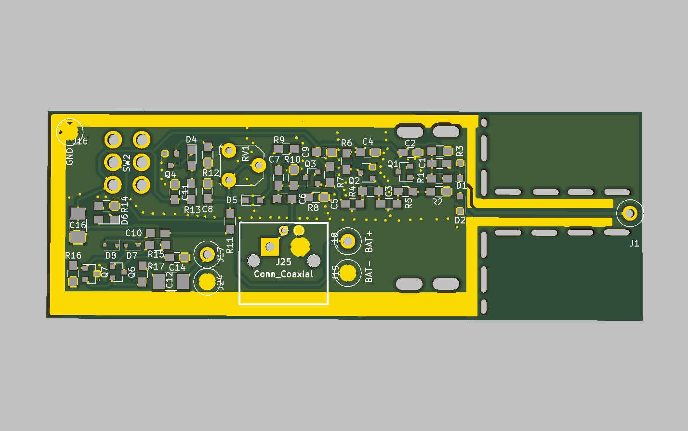

This is an Active RF Probe based on a cheaply available 2SC3356 Bipolar Transistor by Daniel L. Marks, KW4TI.  Dual gate Mosfets are getting hard to find, so this is what I suggest as an alternative RF probe.

The bandwidth is approximately 1 GHz (-3 dB) and the gain at low frequency is 6 dB.

The PCB design is distributed under the Creative Commons Shared Alike Attribution (CC-BY-SA 4.0) license.

